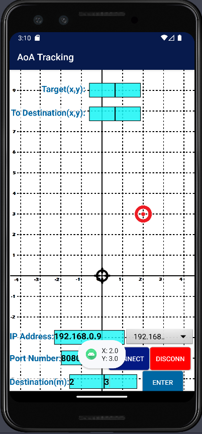
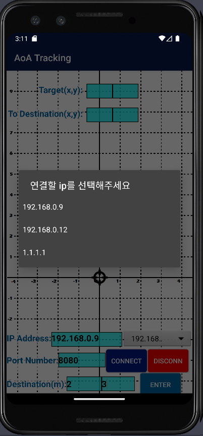

# location_display_app

 
 
This app gets x, y coordinates of a device from server via tcp connection and displays  on android application.
This is made to see a simple map showing exact location of a vehicle.( -4.5m < x < 4.5m  , -6m < y <10m )

[apk file Download Link](https://github.com/DukiChoi/location_display_app/raw/master/apk/location_display_app.apk)
