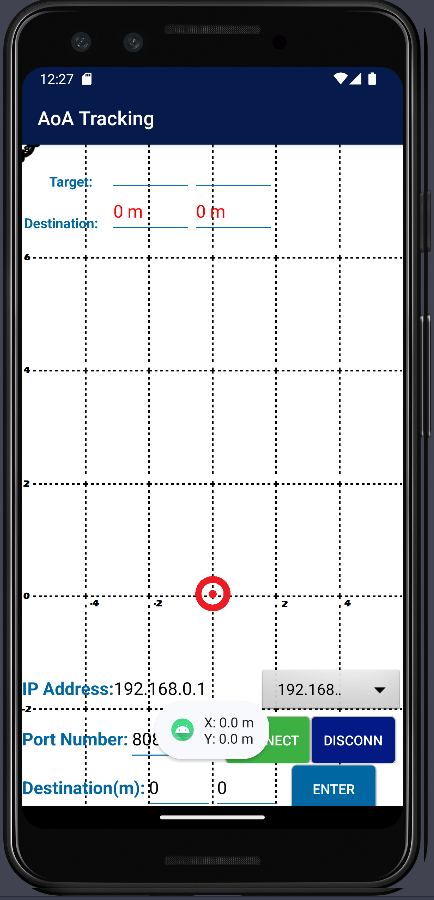

# location_display_app

This app gets x, y coordinates of a device from server bia tcp connection and displays  on android application.
This is made to see a simple map showing exact location of a vehicle.( -4m < x < 4m  , 0m < y <16m )
